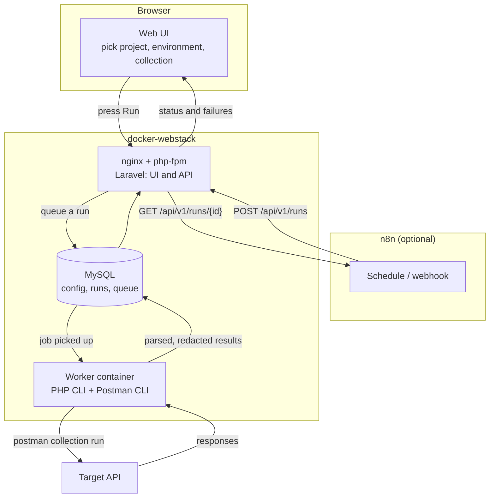

# API Automation

A project-agnostic control center for API integration testing.

One UI to manage API testing across several projects and environments: create a
project, define its environments, import a Postman collection, pick a target,
press Run, and read the result. Runs are stored so you can see what passed,
what failed, and why. Optionally, n8n can trigger the same runs on a schedule
or from a webhook.

## Objective

Testing an API by hand gets repetitive, and the credentials needed to do it end
up scattered across Postman apps, text files and shell history. This tool
solves three things:

1. **One place for credentials.** Each environment keeps all of its variables
   together — plain configuration like `base_url` next to secrets like
   `api_key`, clearly distinguished. Collections reference `{{base_url}}` and
   `{{api_key}}`; they never contain the values.
2. **Repeatable execution.** The same collection runs the same way every time,
   by hand or on a schedule, with results recorded rather than scrolled past.
3. **Answers, not terminal output.** The UI tells you which project,
   environment and collection ran, whether it passed, and which assertion
   failed — without reading raw CLI logs.

## What this is not

It does not replace the tools it drives. Postman Desktop stays the place to
author and debug collections. Postman CLI stays the thing that executes them.
n8n stays the scheduler. This application manages, runs, stores and displays —
nothing more.

So there is no request editor, no test-scripting engine, no variable engine, no
custom scheduler, and no custom execution engine.

## How it works



A run never executes inside the web request. Pressing Run only queues it; the
worker container picks it up. That container is the only place Postman CLI
exists, because PHP running inside the web container cannot launch a program
installed on the host.

### A single run, step by step

```text
1.  Run is created              status QUEUED
2.  Worker picks up the job     status RUNNING
3.  Selected environment is written to a temporary file (deleted afterwards)
4.  Postman CLI executes the collection against the target API
5.  JSON report is parsed, secrets are redacted
6.  Results are stored          status PASS / FAIL / ERROR / TIMEOUT / CANCELLED
7.  Temporary files are removed
```

### Result statuses

An exit code alone never decides the outcome.

| Status | Meaning |
|---|---|
| `PASS` | Report parsed, no failed assertions |
| `FAIL` | Collection ran, at least one assertion failed |
| `ERROR` | Could not execute or could not parse the report |
| `TIMEOUT` | Exceeded the configured wall-clock limit |
| `CANCELLED` | Stopped on request, process confirmed gone |

Only Postman assertions decide pass or fail. An HTTP 401 is a pass if the test
expected 401; an HTTP 200 is a failure if the response body breaks an
assertion. A run that passes with zero assertions is flagged, not celebrated.

## Inbound and outbound

**Inbound** — the usual direction. Postman CLI calls the target API and asserts
on what comes back.

**Outbound** — for checking that your API correctly calls someone else. The
application exposes capture endpoints; you point the system under test at one,
trigger the action, then assert on the request that arrived.

```text
Postman triggers an action  ->  target API calls out  ->  capture endpoint here
                                                                  |
                            Postman polls for the captured call <-+
                                          |
                            assertions on method, URL, body, headers
```

Capture buckets are disabled by default, carry a random token in their URL, and
cannot be created for production environments.

## Security

- **No secrets in this repository.** `.env` is ignored; `.env.example` holds
  placeholders only. Imported collections and temporary environment files live
  outside version control.
- **Secrets at rest** use Laravel's encrypted casts. This protects a database
  dump, not a compromised machine.
- **Secrets to the CLI** are passed in a temporary file with restrictive
  permissions, removed once the run ends — not as command-line arguments,
  which would be visible in the process list.
- **Redaction** is applied before results are stored and before anything is
  displayed. It covers the known secrets of the environment used, plus common
  patterns such as authorization headers and cookies. It is best-effort for
  secrets the application was never told about.
- **Production** environments are badged, excluded from automation by default,
  and require explicit confirmation. Nothing runs on startup.
- **Execution** uses array arguments, never a shell string, and the executable
  path comes only from configuration.

## Requirements

- PHP 8.3+ and Composer
- MySQL 5.7+
- Postman CLI (installed in the worker container, not on the host)
- Node, for building front-end assets

## Status

Early. Phase 0 (scaffold and configuration) is complete: Laravel 13 with
Livewire 4, MySQL, a vhost, and a worker image containing a pinned Postman CLI.

The application's own features — projects, environments, collections, the
runner, result parsing, run history and the n8n API — are not built yet.

No Postman CLI collection run has been executed yet; only its version has been
confirmed. Report parsing is written against real captured output rather than
assumptions, so it waits for that step.

## Documentation

Setup, architecture, decisions and security notes live in `docs/` alongside the
deployment configuration, in the project folder above this one.

## Licence

No licence chosen yet. All rights reserved by default.
